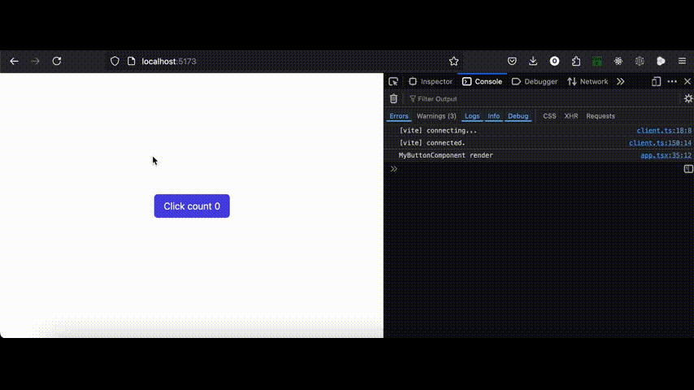
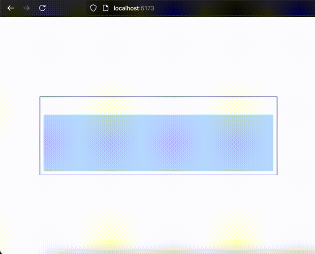

## Introduction

Components are the building blocks of your application. They encapsulate logic, structure, and styling, making it easier to manage and reuse code. 

## Usage

You build components by composing together html tags or other components tags.
You can pass props & children as arguments for a component.

```tsx "props" "children"
function Component(props: ComponentProps, children: unknown) {
    return <div className="text-white px-4 py-2"> {children} </div>;
}
```

### Rendering

An "instance" of a component is being rendered only once, (instance refers to a appearance in the DOM tree), unless it was unmount from the DOM then it being constructed once again there for "run" again.
Changes in signals received from outside or created inside the component do not causing rerendering.

```tsx frame="code" title="MyButtonComponent.tsx"
import { Signal } from 'sig';

interface MyButtonComponentProps {
  count$: Signal<number>; 
  onClick: () => void;
}

export function MyButtonComponent(props: MyButtonComponentProps) {
    console.log('MyButtonComponent render');

    return (
        <button 
            onClick={props.onClick}
            className="bg-indigo-600 text-white px-4 py-2 rounded-md">
        Click count {props.count$}
        </button>
    );
}
```
```tsx frame="code" title="App.tsx"
import { createSignal } from 'sig';
import { MyButtonComponent } from './MyButtonComponent';

export function App() {
    const [clickCount$, setClickCount] = createSignal(0);

    return (
        <div className={'flex flex-col items-center justify-center h-screen'}>
            <MyButtonComponent 
                count$={clickCount$} 
                onClick={() => setClickCount((count) => count + 1)} 
            />
        </div>
    );
}
```


Heres the `MyButtonComponents` screen record showing ui changes & interactivity without rerendering.




### Event Handling


Events in components are handled using the `on` prefix. You can listen to events like `onClick`, `onInput`, etc.
Events are handled by passing a callback function to the event listener property of the element.

```tsx frame="code" title="MouseMovementPad.tsx"
import { createSignal } from 'sig';

interface MouseMovementPadProps {
    randomFactor: number   
}
function MouseMovementPad(props: MouseMovementPadProps) {
    const [random, setRandom] = createSignal('');

    return (<div className={'w-3/4 border border-blue-800 p-2'}>
        <p className={'text-xs min-h-8 break-all'}>{random}</p>
        <div className={'p-2 w-full h-32 bg-blue-200 '} 
            onMouseMove={(e) => {
                const randomMovement = (props.randomFactor * (e.screenX + e.screenY)) % 127;
                const hex = randomMovement.toString(16);
                setRandom(prev => prev + hex);
            }}></div>
    </div>);
}
```

```tsx frame="code" title="App.tsx"
export function App() {
    return <div className={'flex flex-col items-center justify-center h-screen'}>
        <MouseMovementPad randomFactor={42} />
    </div>
}
```

