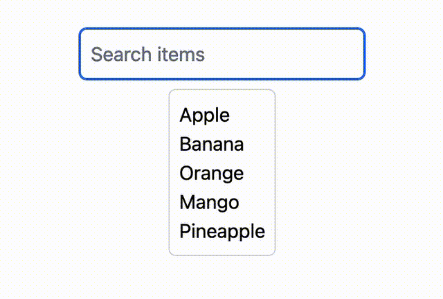

## Introduction

Dynamic rendering is the process of updating the visual representation of a component based on signals. 


### Rendering Dynamic Content

Dynamic content in `sig` is achieved by using some of the primitives provided by the library in combination with signals. 

- `If` component: Renders its condition branch based on the signal value.
- `For` component: Render a list of items based on the signal that holds the list.


:::note 
Conditional rendering and list rendering that embedded in a simple JSX syntax are not dynamic, they are static and result with the output of the first render.

```tsx {4} {11}
function ConditionalRenderingComponent() {
    const [show$, setShow] = createSignal(true);
    return (<div>
        {show$() && <div>Content</div>} // Static rendering
    </div>);
}

function ListRenderingComponent() {
    const [items$, setItems] = createSignal(['Apple', 'Banana', 'Orange']);
    return (<div>
        {items$().map((item) => <div>{item}</div>)} // Static rendering
    </div>);
}
```

:::


---

### `If` Component

The `If` component is used to conditionally render content based on a signal value. 
when the signal value is truthy the `If` component will render the `then` branch, otherwise it will render the `fallback` (else) branch.


```tsx
import { createSignal, If } from 'sig';

function MenuButton() {
    const [isMenuOpen$, setIsMenuOpen] = createSignal(false);
    return (<button className="..."
            onClick={() => setIsMenuOpen((curr) => !curr)}>
            <If
                condition={isMenuOpen$} 
                then={<X className="block h-6 w-6" />}
                fallback={<Menu className="block h-6 w-6" />}
            />
        </button>);
}
```


---

### `For` Component

The `For` component is used to render a list of items based on a signal that holds the list.


Here is an example of how to use the `For` component to render a list of items:
The list display the filtered search result of the items based on the search term.


```tsx {17-22} {"*": 6-9}
import { For, createSignal, combineLatest } from 'sig';

function SearchList() {
    const [items$, _setItems] = createSignal(['Apple', 'Banana', 'Orange', 'Mango', 'Pineapple']);
    const [searchTerm$, setSearchTerm] = createSignal('');
    const filteredItems$ = combineLatest([items$, searchTerm$])
        .derive<string[]>(([items, searchTerm]) => !searchTerm ? items : items
        .filter((item) => item.toLowerCase()
        .includes(searchTerm.toLowerCase()))
    );
    return (<div className="...">
        <input 
            value={searchTerm$}
            onInput={(e) => setSearchTerm(e.target.value)}
            placeholder="Search items"
            className="..." />
        <For
            as='div' asProps={{ className: "..." }}
            list={filteredItems$}
            empty={<div>No items</div>}
            factory={(item) => <div>{item}</div>}
        />
    </div>);
}
```

:::note
`*` `combineLatest` is a more advanced API, it reduce multiple signals into a single signal that emits each time one of the input signals emits, it returns an array of the latest values from each input signal.
:::





#### `For` Item Indexing

The `For` component manages indexing of the rendered items in the list, it is crucial that the "index" (key) of each item is unique in order handle changes in the list's items and order. 

The `For` component will use the `index` to track the items in the list, and update the items in the list when the list changes.
By providing an `index` to the `For` component, you can specify how to generate the key for each item.

When `index` prop is provided :
- if it is a `function`, it will be called with the item and the index of the item in the list.
- if it is a `string`, it will be used as a property name to extract the key from the item object.

When no `index` prop provided, the default indexing behavior is the following:
- If the item is a primitive value, the index will be the item value.
- If the item is an `object`, the index will be the index of the item in the list.

