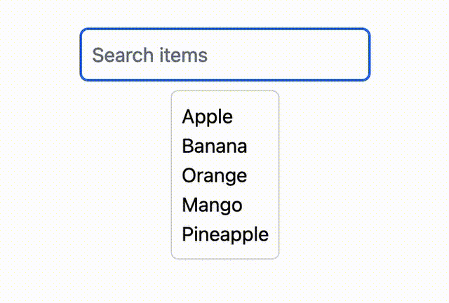

import { Image } from 'astro:assets';

## Introduction

Dynamic rendering is the process of updating the visual representation of a component based on signals. 


### Rendering Dynamic Content

Dynamic content in `sig` is achieved by using some of the primitives provided by the library in combination with signals. 

- `If` component: Renders its condition branch based on the signal value.
- `For` component: Render a list of items based on the signal that holds the list.
- `Switch`, `Case` & `Default` components: Render the first `Case` component whose `condition` signal is truthy, otherwise render the `Default` component.
- `Await` component: Render an asynchronous component or a lazy-loaded component (or both).

:::note 
Conditional rendering and list rendering that embedded in a simple JSX syntax are not dynamic, they are static and result with the output of the first render.

```tsx {4} {11}
function ConditionalRenderingComponent() {
    const [show$, setShow] = createSignal(true);
    return (<div>
        {show$() && <div>Content</div>} // Static rendering
    </div>);
}

function ListRenderingComponent() {
    const [items$, setItems] = createSignal(['Apple', 'Banana', 'Orange']);
    return (<div>
        {items$().map((item) => <div>{item}</div>)} // Static rendering
    </div>);
}
```

:::


---

### `If` Component

The `If` component is used to conditionally render content based on a signal value. 
when the signal value is truthy the `If` component will render the `then` branch, otherwise it will render the `fallback` (else) branch.


```tsx
import { createSignal, If } from 'sig';

function MenuButton() {
    const [isMenuOpen$, setIsMenuOpen] = createSignal(false);
    return (<button className="..."
            onClick={() => setIsMenuOpen((curr) => !curr)}>
            <If
                condition={isMenuOpen$} 
                then={<X className="block h-6 w-6" />}
                fallback={<Menu className="block h-6 w-6" />}
            />
        </button>);
}
```

import MenuButton_720 from '../../../assets/MenuButton_720.gif';

<Image
    style={{ margin: 'auto', display: 'block', padding: '1rem' }}
    src={MenuButton_720} alt="MenuButton" />


{/*  */}

---

### `For` Component

The `For` component is used to render a list of items based on a signal that holds the list.


Here is an example of how to use the `For` component to render a list of items:
The list display the filtered search result of the items based on the search term.


```tsx {17-22} {"*": 6-9}
import { For, createSignal, combineLatest } from 'sig';

function SearchList() {
    const [items$, _setItems] = createSignal(['Apple', 'Banana', 'Orange', 'Mango', 'Pineapple']);
    const [searchTerm$, setSearchTerm] = createSignal('');
    const filteredItems$ = combineLatest([items$, searchTerm$])
        .derive<string[]>(([items, searchTerm]) => !searchTerm ? items : items
        .filter((item) => item.toLowerCase()
        .includes(searchTerm.toLowerCase()))
    );
    return (<div className="...">
        <input 
            value={searchTerm$}
            onInput={(e) => setSearchTerm(e.target.value)}
            placeholder="Search items"
            className="..." />
        <For
            as='div' asProps={{ className: "..." }}
            list={filteredItems$}
            empty={<div>No items</div>}
            factory={(item) => <div>{item}</div>}
        />
    </div>);
}
```

:::note
`*` `combineLatest` is a more advanced API, it reduce multiple signals into a single signal that emits each time one of the input signals emits, it returns an array of the latest values from each input signal.
:::


import SearchList_480 from '../../../assets/SearchList_480.gif';

<Image
    style={{ margin: 'auto', display: 'block', padding: '1rem' }}
    src={SearchList_480} alt="SearchList" />

{/*  */}   


#### `For` Item Indexing

The `For` component manages indexing of the rendered items in the list, it is crucial that the "index" (key) of each item is unique in order handle changes in the list's items and order. 

The `For` component will use the `index` to track the items in the list, and update the items in the list when the list changes.
By providing an `index` to the `For` component, you can specify how to generate the key for each item.

When `index` prop is provided :<br/>
\- if it is a `function`, it will be called with the item and the index of the item in the list.<br/>
\- if it is a `string`, it will be used as a property name to extract the key from the item object.

When no `index` prop provided, the default indexing behavior is the following:<br/>
\- If the item is a primitive value, the index will be the item value.<br/>
\- If the item is an `object`, the index will be the index of the item in the list.

---

### `Switch`, `Case` & `Default` Components

The `Switch`, `Case` & `Default` components are used to render the first `Case` component whose `condition` signal is truthy, otherwise render the `Default` component.

Here is an example of how to use the `Switch`, `Case` & `Default` components to render a component based on the selected tab:

```tsx
import { createSignal, Switch, Case, Default } from 'sig';

function TabContent() {
    const [selectedTab$, setSelectedTab] = createSignal('Tab1');
    return (<div className="...">
        <button onClick={() => setSelectedTab('Tab1')}>Tab1</button>
        <button onClick={() => setSelectedTab('Tab2')}>Tab2</button>
        <Switch condition={selectedTab$}>
            <Case value='Tab1'>
                <div>Tab1 content</div>
            </Case>
            <Case value='Tab2'>
                <div>Tab2 content</div>
            </Case>
            <Default>
                <div>No content</div>
            </Default>
        </Switch>
    </div>);
}
```


---

### `Await` Component

The `Await` component is used to render an asynchronous component or a lazy-loaded component (or both).

Basically the `Await` component expect a `component` field, that can be a : <br/>
\-  An async component function. <br/>
\- Function that return a `Promise` of an object with a `default` field with a value of a component function.

Lets focus first on the lazy loading part first, This is useful when you want to load a component only when it is needed, and not including it unnecessarily in the main build.

Combining the `Await` component with the `import` function, we're getting a powerful pattern, to ship only the necessary code to the client. 

Here is an example of how to use the `Await` component to render a lazy-loaded component:

```tsx
import { Await, If } from 'sig';
const lazyComponent = () => import('./LazyComponent');

function MainPage() {
    const [showLazyComponent$, setShowLazyComponent] = createSignal(false);
    return (<div>
        <button onClick={() => setShowLazyComponent((curr) => !curr)}>Toggle</button>
        <If condition={showLazyComponent$}
            then={<Await component={lazyComponent} />
    </div>);
}

```

:::note
The dynamically imported module must default export the component.
:::

In the above example, the `If` component will render the `Await` component only when the `showLazyComponent$` signal is truthy, 
and when the `Await` component is rendered, it will load and render the `LazyComponent` component.

When inspecting the network tab in the browser, you will see that the `LazyComponent` build file, is loaded only when the button is clicked.


The `Await` component can also be used to render an asynchronous component, which is useful when you need to fetch data asynchronously before rendering the component.

Here is an example of how to use the `Await` component to render a component that fetches data asynchronously:

```tsx
import { createSignal, Await } from 'sig';

async function AsyncUserCard() {
    const user = await fetch('/api/user').then((res) => res.json());

    return (<div>
        
        <div>{user.name}</div>
    </div>);
}

function HomePage() {
    return (<div>
        <Await component={AsyncUserCard} />
    </div>);
}
```