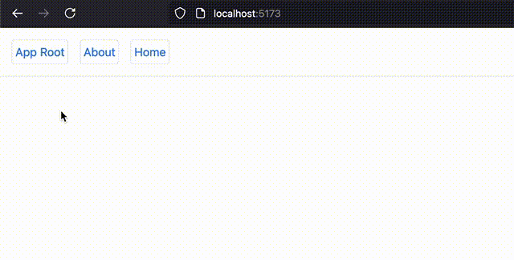

---
title: Routing
description: A comprehensive guide on routing.
---

import { LinkButton } from '@astrojs/starlight/components';

Routing is the process of determining which component to display based on the current URL. 
It is a fundamental part of building single-page applications (SPAs) that have multiple views.

## Creating A Router

`sig` comes with a build in `sig/router` module, providing `Router` functionalities that allows you to define your application's routes and views.

By calling the `createRouter` function with routes config, you create a `router` component.

```tsx showLineNumbers=false
function createRouter(config: RouterConfig): VirtualElement
```

for now, lets focus on the `RouterConfig` property `routes` which is an array of `RouteConfig` objects defining the routes of the application.

## Configuring your routes

A `RouteConfig` object has three main properties:

- `path`: The URL path to match.
- `component`: The component to render when the path matches.
- `children`: An array of nested child routes.

Let's start with a simple example:

Here's two pages, `Home` and `About`:
```tsx
function Home() {
    return <div>Home Page !</div>;
}

function About() {
    return <div>About Page !</div>;
}
```

:::note 
This example uses the `Link` and `router-outlet` components from `sig/router`.

`1` - `Link` component is used instead of the native `a` tag, to do an in-app navigate using the router.

`2` - `router-outlet` tag allows parent route elements to render their child route elements. This allows nested route components to show up when child routes are rendered.

:::

And a common `Layout` component that will be used to wrap the pages:


```tsx {"1":10-11} {"2":16}
import { Link } from "sig/router";
function Layout() {
    return (
        <div className="flex flex-col items-center">
            <nav className="flex gap-4">
                <Link className="border text-blue-500" to="/">App Root</Link>
                <Link className="border text-blue-500" to="/about">About</Link>
                <Link className="border text-blue-500" to="/home">Home</Link>
            </nav>
            <div className="flex flex-col items-center">
                <router-outlet />
            </div>
        </div>
    );
}
```

## Render The Router.

Now, let's create the router and define the routes:

```tsx 
import { createRouter } from 'sig';
function AppRouter() {
    return createRouter({
        routes: [{
            path: '/', component: Layout,
            children: [
                { path: '/home', component: About },
                { path: '/about', component: About }
            ],
        }]
    });
}
```

On the root route `/` we define the `Layout` as the route page, in this route we define the child routes `/home` and `/about` with their respective components `Home` and `About`.
In the `Layout` components there's a `router-outlet` tag allowing the child routes to render in the parent `Layout` component.


Finally, render the `AppRouter` component in the `App` component:

```tsx
function App() {
    return <AppRouter />;
}
```



---

<LinkButton href="/routing-guides/configure-routes" variant="secondary">More on Sig Router</LinkButton>